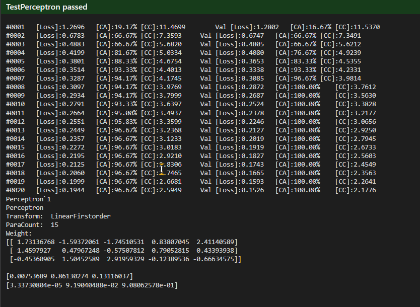
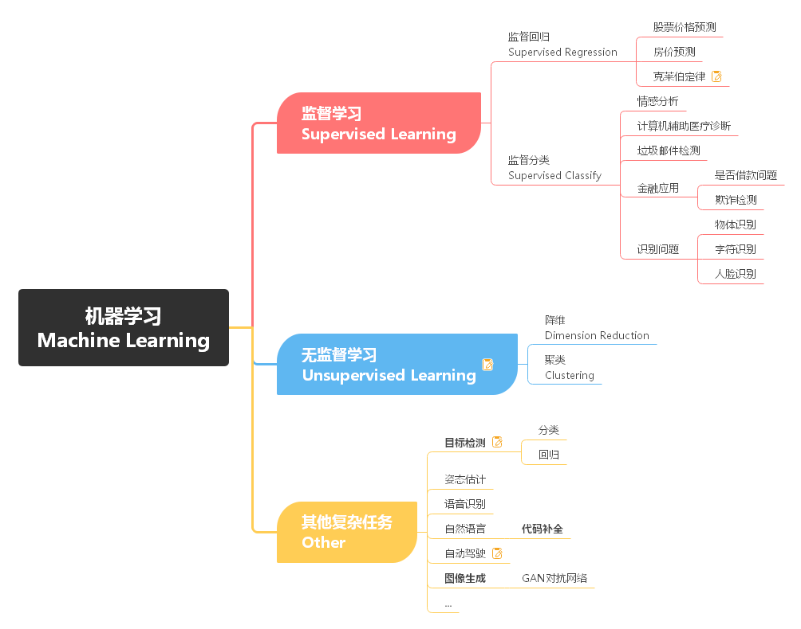
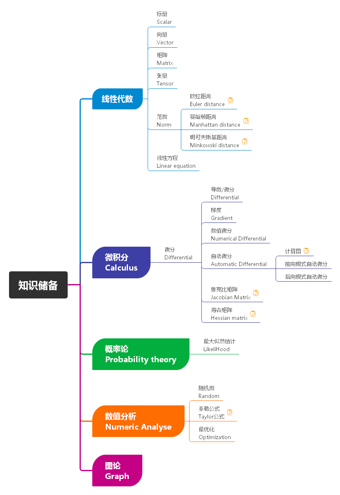
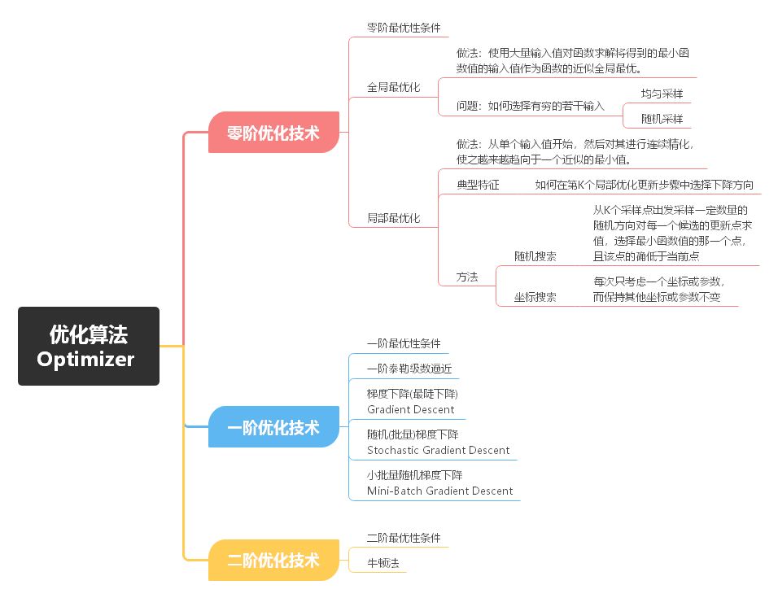
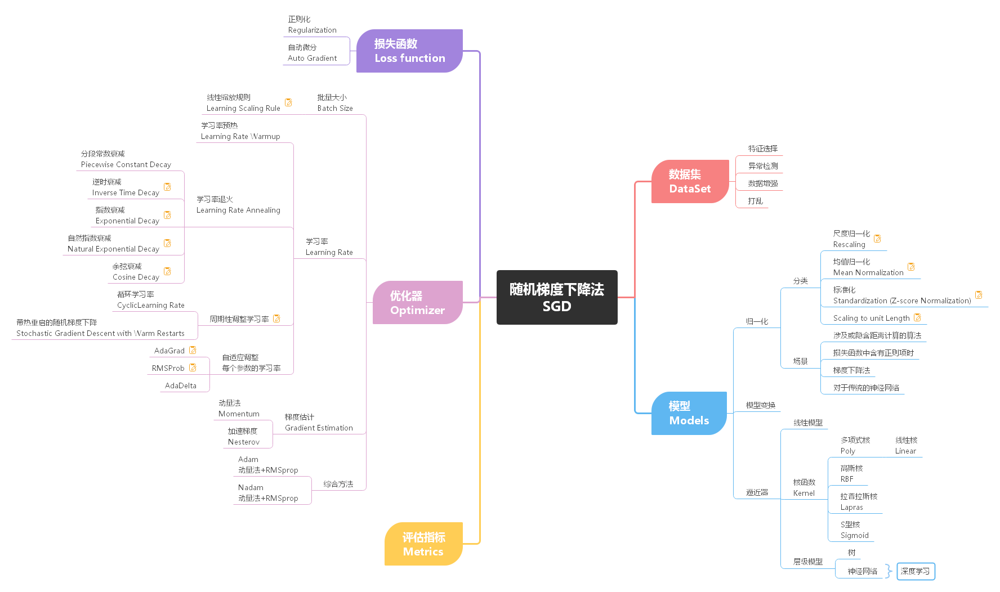
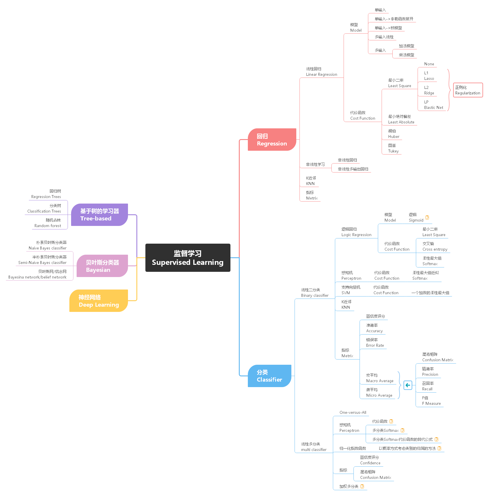
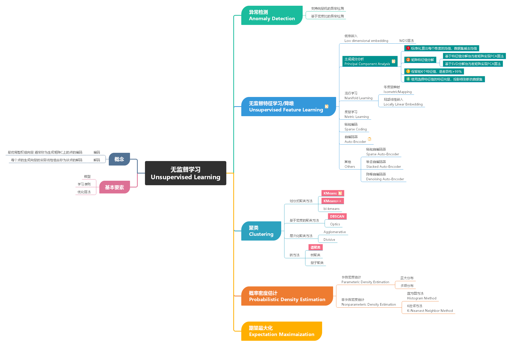
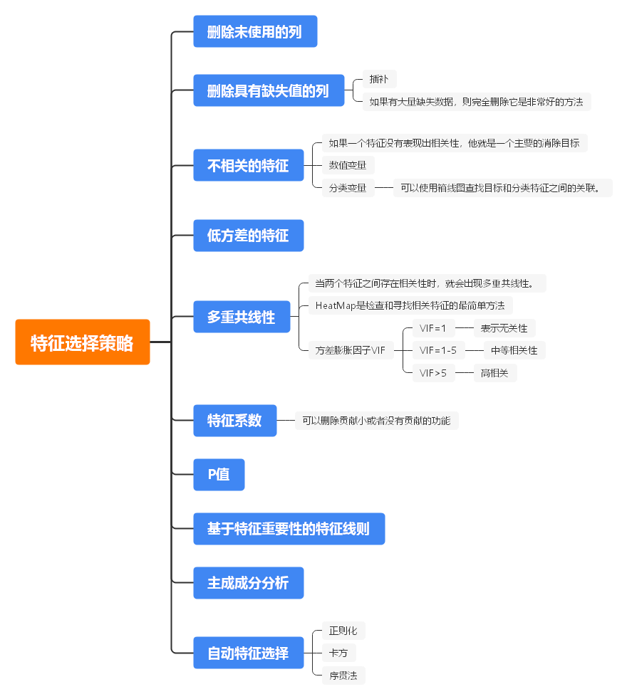
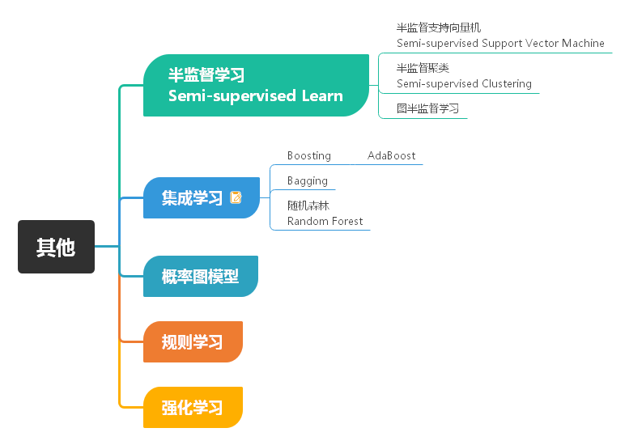

# ML-Sharp


## [](https://repography.com)  Top contributors
[](https://github.com/xin-pu/ML-Sharp/graphs/contributors)


## [](https://repography.com)  Structure
[](https://github.com/xin-pu/ML-Sharp)


## Demo
```
var trainDataset = GetIris("iris-train.txt");
var valDataset = GetIris("iris-test.txt");

var trainer = new GDTrainer<IrisDataOneHot>
{
    TrainDataset = trainDataset.Shuffle(),
    ValDataset = valDataset.Shuffle(),
    ModelGd = new Perceptron<IrisDataOneHot>(3),
    Optimizer = new Nadam(1E-2),
    Loss = new CategoricalCrossentropy(),

    TrainPlan = new TrainPlan {Epoch = 20, BatchSize = 10},
    Metrics = new ObservableCollection<Metric>
    {
        new CategoricalAccuracy(),
        new Metrics.Categorical.CategoricalCrossentropy()
    },

    Print = _testOutputHelper.WriteLine
};

await trainer.Fit();
print(trainer.ModelGd);

var Iris1 = new IrisDataOneHot
{
    Label = 1,
    SepalLength = 6.6,
    SepalWidth = 2.9,
    PetalLength = 4.6,
    PetalWidth = 1.3
};
var Iris2 = new IrisDataOneHot
{
    Label = 2,
    SepalLength = 7.2,
    SepalWidth = 3.5,
    PetalLength = 6.1,
    PetalWidth = 2.4
};

var pred = trainer.ModelGd.Call(Iris1);
print(pred);


pred = trainer.ModelGd.Call(Iris2);
print(pred);
 ```

 


 ## MindMaster

 
 
 

 

 

 

 

 

 

